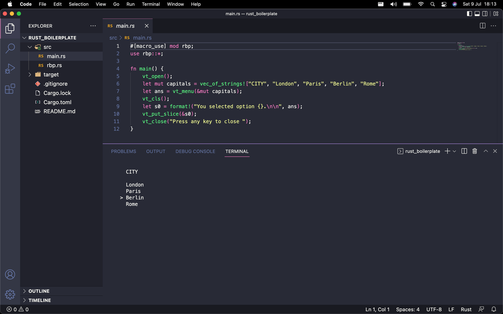

# Rust Boilerplate

MacOS boilerplate for Rust.



## Adjustment to work properly on GNU/Linux distros

Globally substitute the ascii code '127' with the macro 'KEY_BACKSPACE'.

## Terminal helpers

```
input(prompt: &str) -> String
```

Prompts the user for input and returns it as a string.

```
cls()
```

Clears the terminal window on some terminal emulators.

e.g. does not work with the Intellij terminal.

```
unix_shell(x: &str)
```

Executes slices as unix shell commands.

- Some shell commands will not work on all terminal emulators. (e.g. "clear" in the Intellij terminal).

- Compound shell commands will not work properly (e.g. commands using the "&&" operator).

## Random numbers

```
seed()
```

Seeds the pseudo-random number generator with unix time.

```
pseudo(x: i32, y: i32) -> i32
```

Generates a pseudo-random number between x and y.

## Strings and chars

```
vec_of_strings!
```

A macro to initialise a vector of strings.

```
nth_char(x: &str, n: usize) -> char
```

Returns the nth char (zero indexed) from a slice.

```
is_digits(x: &str) -> bool
```

Checks if a slice consists only of digits.

```
is_i32(x: &str) -> bool
```

Checks if a slice represents an i32 integer.

```
is_f64(x: &str) -> bool
```

Checks if a slice represents an f64 float.

```
to_i32(x: &str) -> i32
```

Converts a slice to an i32 integer.

```
to_f64(x: &str) -> f64
```

Converts a slice to an f64 float.

```
char_count(x: &str) -> usize
```

Counts the number of chars in a slice.

```
slice_count(x: &str, y: char) -> usize
```

Counts the number of substrings in a slice, as delimited by a given char.

```
word_count(x: &str) -> usize
```

Counts the number of words in a slice.

```
line_count(x: &str) -> usize
```

Counts the number of lines in a slice.

```
nth_slice(x: &str, y: usize, z: char) -> String
```

Returns the nth slice (zero indexed) from a larger slice, as delimited by a given char.

```
nth_word(x: &str, y: usize) -> String
```

Returns the nth word (zero indexed) from a slice.

```
nth_line(x: &str, y: usize) -> String
```

Returns the nth line (zero indexed) from a slice.

```
yeet_empty_tokens(v: Vec<String>) -> Vec<String>
```

Removes all empty strings from a vector of strings.

## File IO

```
write_to_file(path: &str, data: &str)
```

Writes data to a file.

```
file_exists(path: &str) -> bool
```

Returns true if the file path exists.

```
append_to_file(path: &str, data: &str)
```

Appends data to a file.

```
delete_file(path: &str)
```

Deletes the file on the named path.

```
read_from_file(path: &str) -> String
```

Reads data from a file into a string.

## Virtual terminal

- These functions will not work on Windows.

- Only ASCII characters will be displayed correctly in the virtual terminal.

- These functions will not work properly on some terminal emulators (e.g. the IntelliJ terminal).

```
vt_open()
```

Opens the virtual terminal.

```
vt_close(x: &str)
```

Displays a message, then closes the virtual terminal on the next user key press.

```
vt_cursor_off()
```

Hides the virtual cursor.

```
vt_cursor_on()
```

Displays the virtual cursor.

```
vt_rows() -> i32
```

Returns the number of rows in the virtual terminal.

```
vt_columns() -> i32
```

Returns the number of columns in the virtual terminal.

```
vt_cls()
```

Clears the virtual terminal.

```
vt_key_i32() -> i32
```

Obtains an i32 integer from a virtual terminal key press.

```
vt_input(x: i32) -> String
```

Obtains user input as a string with no more than x chars.

```
vt_put_slice(x: &str)
```

Displays a slice in the virtual terminal.

```
vt_render_menu(menu:&mut Vec<String>, size:usize, count:usize)
```

A helper function called by vt_menu.

```
vt_menu(menu:&mut Vec<String>) -> usize
```

Returns a usize integer based on the user's selection from a menu.

```
vt_render_prompt(prompt:&str, buffer:&mut String, pos:usize)
```

A helper function called by vt_edit_prompt.

```
vt_edit_prompt(prompt:&str, buffer:&mut String, max:usize) -> String
```

Displays a prompt to the user with an existing buffer, which can be edited to return a new buffer.
